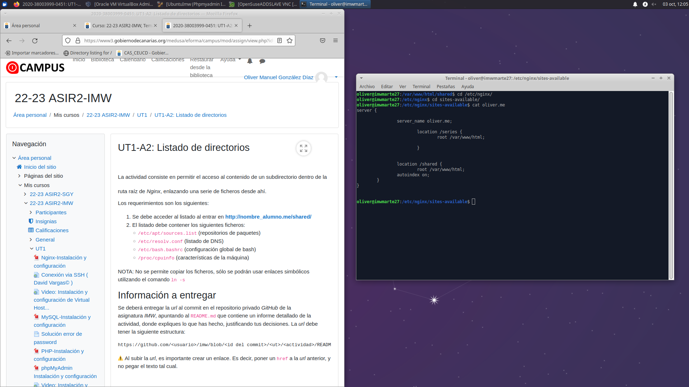
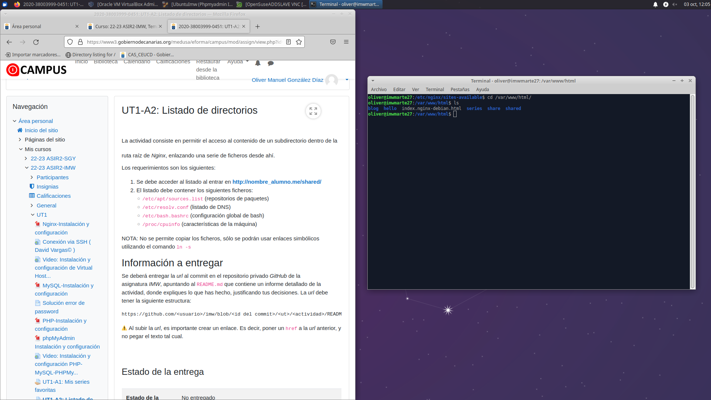
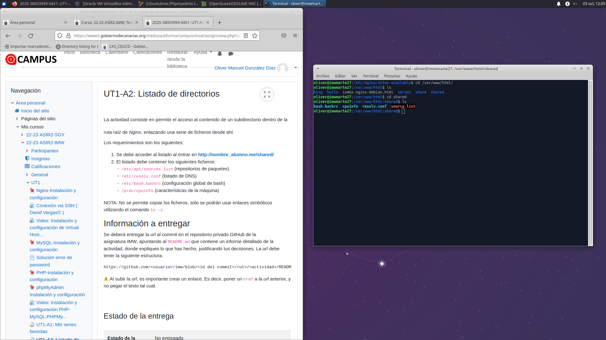
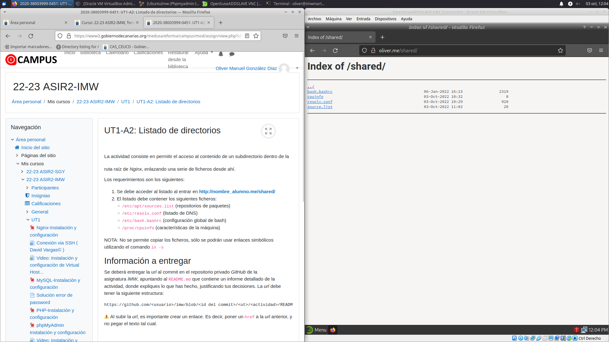

# Listado de directorios

***Nombre:*** Oliver Manuel Gonzalez Diaz
***Curso:*** 2º de Ciclo Superior de Administración de Sistemas Informáticos en Red.

### ÍNDICE

+ [Introducción](#id1)
+ [Creamos el VirtualHost](#id2)
+ [Creamos el Index](#id3)
+ [Pagina Terminada](#id4)

#### ***Introducción***. 

Listado de los directorios con redirecciones sin copiar los archivos.

#### ***Creamos el VirtualHost***. 

Enseño el VirtualHost Creado.

#### ***Creamos el Index***. 

Muestro donde esta el Index y sus redirecciones.

> ***Pagina terminada:*** 

Muestro la pagina terminada.

