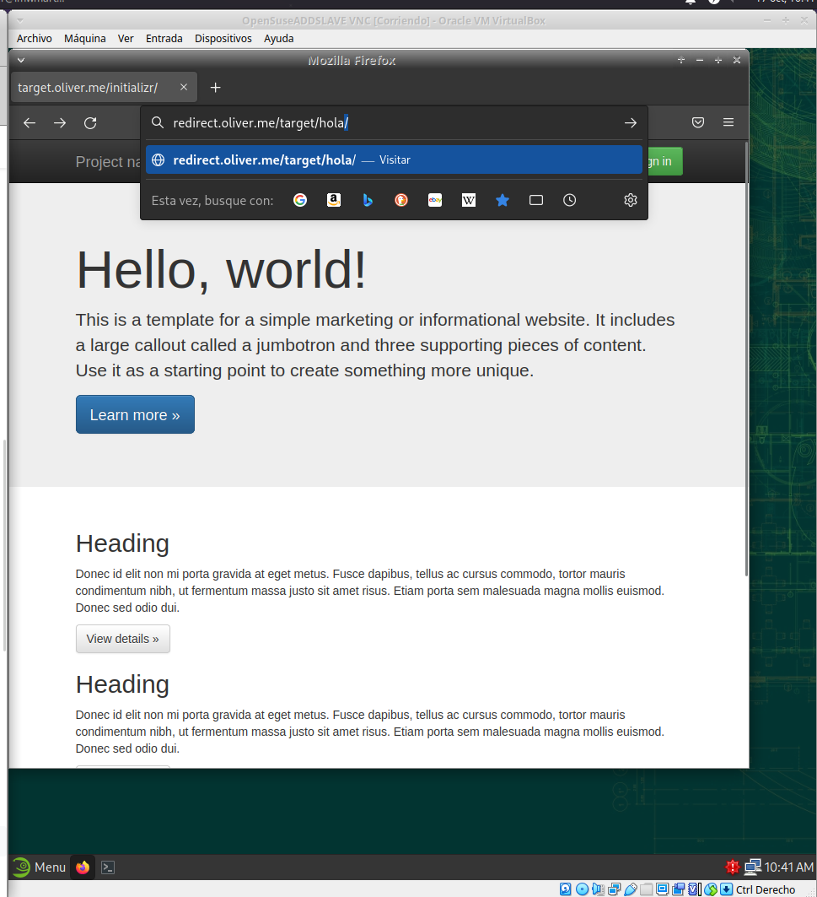

# Listado de directorios

***Nombre:*** Oliver Manuel Gonzalez Diaz
***Curso:*** 2º de Ciclo Superior de Administración de Sistemas Informáticos en Red.

### ÍNDICE

+ [Sitio web 1](#id1)
+ [Sitio web 2](#id2)
+ [Sitio web 3](#id3)
+ [Sitio web 4](#id4)

#### ***Sitio Web 1***. 

    http://imw.nombre_alumno.me
        
        Debe mostrar una página con la imagen del "Diagrama de unidades de trabajo" de IMW":.

http://imw.nombre_alumno.me/mec/

    No utilizar un location.
    Debe mostrar una página con un enlace al Real decreto del título de Administración de Sistemas Informáticos en Red - MEC (ver moodle de la asignatura).

#### ***Sitio Web 2***. 

    http://varlib.nombre_alumno.me:9000
    Debe mostrar el listado de ficheros y directorios de /var/lib de la máquina de producción.
    Pensar qué root definir para conseguir el objetivo planteado.

#### ***Sitio Web 3***. 

    https://ssl.nombre_alumno.me/students/ (ojo, es https!)
    Debe pedir usuario/clave. Los datos son:
        USUARIO: usuario1
        CLAVE: 2asir
    Debe mostrar una página web con el nombre de todo el alumnado de clase.
    Se debe prohibir explícitamente el acceso al fichero htpasswd

> ***Sitio Web 4*** 

Muestro la pagina terminada.

    http://redirect.nombre_alumno.me

    Se debe redirigir cualquier petición de este dominio a http://target.aluXXXX.me
        http://redirect.nombre_alumno.me/test/ -> http://target.nombre_alumno.me
        http://redirect.nombre_alumno.me/probando/ -> http://target.nombre_alumno.me
        http://redirect.nombre_alumno.me/hola/ -> http://target.nombre_alumno.me
        ...

    Al acceder a http://target.nombre_alumno.me se debe mostrar la página web que se adjunta en el archivo initializr-verekia-4.0.zip.
        Para copiar y descomprimir el fichero initializr.zip se recomienda usar alguna de las siguientes herramientas: curl, wget, scp, unzip.

    Los logfiles deben ser:
        /var/log/nginx/redirect/access.log
        /var/log/nginx/redirect/error.log

