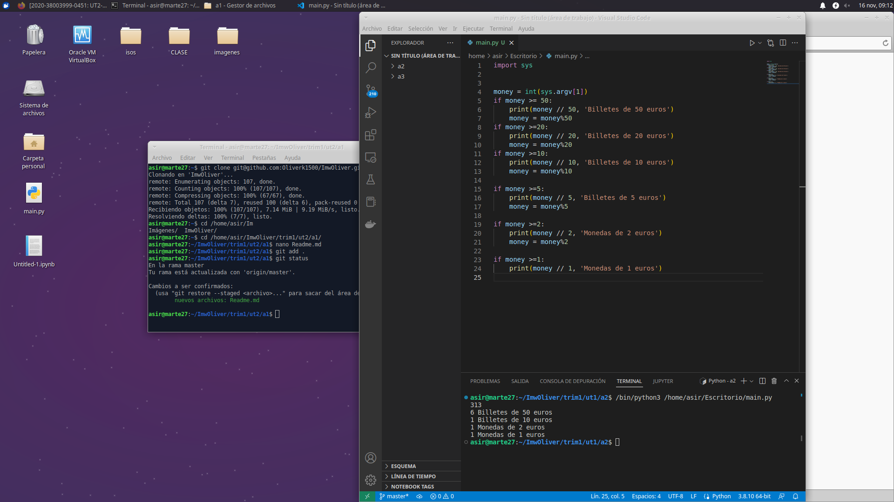

# Tarea Me da cambio por favor?

***Nombre:*** Oliver Manuel Gonzalez Diaz
***Curso:*** 2º de Ciclo Superior de Administración de Sistemas Informáticos en Red.

### ÍNDICE

+ [Explicacion](#id1)

#### ***Sitio Web 1***. 

   Documento de se eseña el programa y para subir el programa a github

   Como se ve en la foto funciona perfectamente y si ponemos de numero 313 nos da los billetes selecionados

